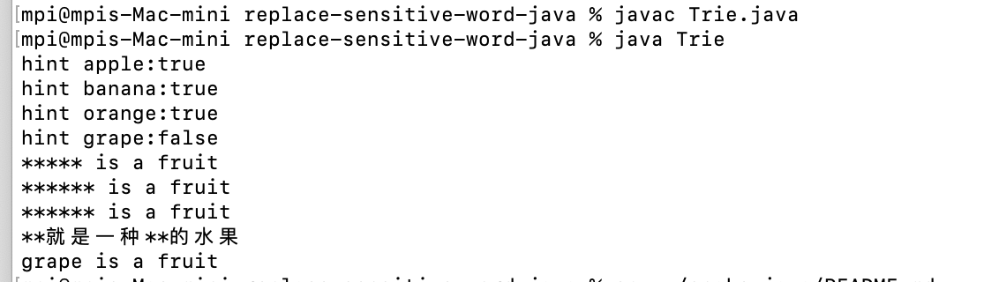

# Use Trie tree to replace sensitive words, implemented with 100 lines of Java code

By [ruzhila.cn](http://ruzhila.cn/?from=github_trie_java), a campus for learning backend development through practice.

This is a tutorial code demonstrating how to use Java replace sensitive words. Pull requests are welcome. 👏



## Usage
```bash
javac Trie.java
java Trie
```